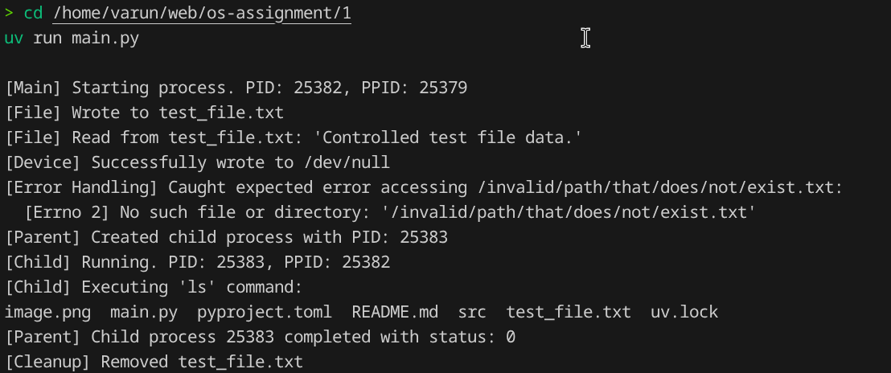

# Operating Systems Lab Assignment

**Name:** Varun Chauhan  
**Roll Number:** 2401010276  
**Course:** B.Tech CSE Sec B  
**Assignment Title:** System Calls and Process Creation  

## Requirements/Software Used
* Ubuntu Linux (or WSL)
* Python 3.12.14
* Visual Studio Code
* `uv` (Python package manager)

## Aim
To write a Python script that creates a child process, performs process management (displaying PIDs, waiting for completion), executes a Linux command, performs file operations, inspects device interfaces (like `/dev/null`), and handles errors gracefully.

## Approach/Algorithm
1. **Process Management:** Used `os.fork()` to spawn a child process. Used `os.getpid()` and `os.getppid()` to display IDs. Used `os.wait()` in the parent to wait for the child process.
2. **Command Execution:** Used `os.system("ls")` in the child process to safely run a Linux command.
3. **File Operations:** Used standard Python `open()` with context managers (`with`) to create, write, and read a controlled text file.
4. **Device Interface:** Attempted writing to `/dev/null` using standard file operations to verify it acts as a sink.
5. **Error Handling:** Intentionally tried to read a non-existent file path inside a `try...except` block, catching the `FileNotFoundError` and logging it.

## Output Screenshot

## Conclusion
The script successfully demonstrates fundamental OS concepts. The parent and child processes execute asynchronously but the parent successfully waits for the child's termination. Interactions with OS devices (`/dev/null`) and error handling function exactly as expected by the POSIX standard.

## GitHub Repository
[https://github.com/chauhan-varun/os-assignment](https://github.com/chauhan-varun/os-assignment)