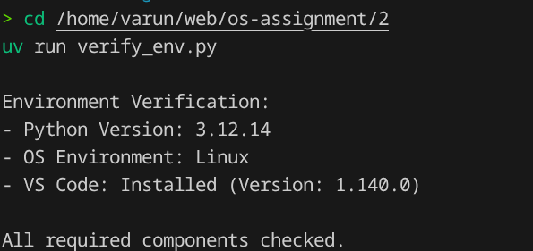

# Operating Systems Lab Assignment

**Name:** Varun Chauhan  
**Roll Number:** 2401010276  
**Course:** B.Tech CSE Sec B  
**Assignment Title:** Lab Environment Setup

## Requirements/Software Used
* Ubuntu Linux (or WSL)
* Python 3.12.14
* Visual Studio Code
* `uv` (Python package manager)

## Aim
To set up and configure the required environment for the Operating Systems Lab (Ubuntu Linux, WSL, VS Code, and Python) and verify each component is working correctly.

## Approach/Algorithm
1. **Verification Script:** Wrote a Python script to automatically verify the environment.
2. **Python Check:** Used the built-in `sys.version` to verify the Python installation.
3. **OS Check:** Read from `/proc/version` to determine if the script is running under WSL, Ubuntu, or generic Linux.
4. **VS Code Check:** Used the `subprocess` module to run `code --version` to verify Visual Studio Code is installed and accessible in the PATH.

## Output Screenshot

## Conclusion
The environment has been successfully set up and verified. The script properly detected the Linux/WSL environment, the Python version, and the VS Code installation, confirming readiness for future lab experiments.

## GitHub Repository
[https://github.com/chauhan-varun/os-assignment](https://github.com/chauhan-varun/os-assignment)