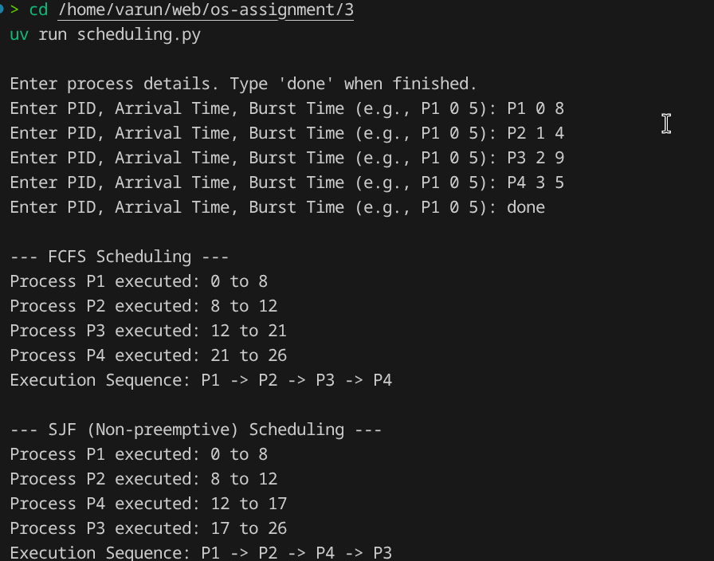

# Operating Systems Lab Assignment

**Name:** Varun Chauhan  
**Roll Number:** 2401010276  
**Course:** B.Tech CSE Sec B  
**Assignment Title:** FCFS and SJF Scheduling

## Requirements/Software Used
* Ubuntu Linux (or WSL)
* Python 3.x
* Visual Studio Code
* `uv` (Python package manager)

## Aim
To simulate and compare two CPU scheduling algorithms: First-Come, First-Served (FCFS) and Non-preemptive Shortest Job First (SJF), using the same process dataset.

## Approach/Algorithm
1. **Input:** The script interactively accepts process details (PID, Arrival Time, Burst Time) until the user types 'done'. It validates all inputs.
2. **FCFS Algorithm:** Processes are sorted strictly by Arrival Time. The CPU executes them in that exact order, keeping track of the current time and advancing it by the burst time. If the CPU is idle, the current time jumps to the next arrival.
3. **SJF Algorithm (Non-preemptive):** Processes are initially sorted by Arrival Time. A `while` loop checks all processes that have arrived up to the `current_time`. From this available pool, the one with the smallest Burst Time is selected (with arrival time as a tie-breaker).
4. **Output:** The script logs the start/end execution intervals and prints the final execution sequence.

## Output Screenshot

## Calculations
The script internally calculates the execution start and end times by continuously adding the process Burst Time to the `current_time` tracker. Wait times can be derived from `Start Time - Arrival Time`.

## Conclusion
SJF generally provides a more optimized execution sequence for processes with shorter burst times compared to FCFS, which suffers from the convoy effect if a long process arrives early. The script accurately modeled CPU idle times and tie-breaking rules for both algorithms.

## GitHub Repository
[https://github.com/chauhan-varun/os-assignment](https://github.com/chauhan-varun/os-assignment)